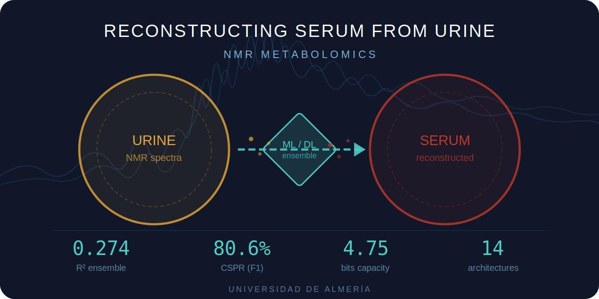

<p align="center">
  
</p>

# Reconstructing Serum Metabolomic Profiles from Urine NMR Data

[](https://opensource.org/licenses/MIT)
[](https://www.python.org/downloads/)
[]()

**Proof-of-concept for indirect clinical prediction via cross-biofluid metabolomic reconstruction.**

> Marín-Manzano JD, Arrabal-Campos FM*, Fernández I*  
> Universidad de Almería, Spain

---

## Overview

This repository contains the code for reconstructing serum metabolomic profiles from urine NMR data using machine learning and deep learning, and evaluating the clinical utility of the reconstructed profiles for disease diagnosis and biomarker prediction.

**Key idea:** Urine is non-invasive and easy to collect, but most clinical biomarkers are measured in blood. We show that serum metabolomic profiles can be partially reconstructed from urinary NMR data, and that **77–84% of the clinically relevant diagnostic signal is preserved** through this reconstruction.

### Pipeline

```
Urine NMR → [Reconstruction: 14 ML/DL models + ensemble] → Reconstructed Serum
    → [Classification] → COVID diagnosis, GGT, Creatinine, HDL prediction
    → [Information Transfer Analysis] → CSPR, channel capacity, ITE metrics
```

### Key Results

| Metric | Value |
|--------|-------|
| Best reconstruction R² | 0.274 (weighted ensemble) |
| Best single model R² | 0.259 (TabPFN) |
| Clinical Signal Preservation (CSPR) | 76.9% (AUC), 80.6% (F1) |
| Channel Capacity | 4.75 bits |
| Models evaluated | 14 architectures |

## Repository Structure

```
├── serum_reconstruction_v4.py      # Main reconstruction pipeline (14 models + ensemble)
├── classification_ensemble.py      # Clinical classification using reconstructed serum
├── info_transfer_analysis.py       # Shannon information transfer quantification
├── setup.sh                        # Environment setup script
├── requirements.txt                # Python dependencies
├── Data/                           # NMR data (not included — see below)
├── Results_Advanced/               # Pre-computed results
│   ├── results_comparison_v4.xlsx
│   ├── predicted_serum_ensemble.xlsx
│   ├── classification_summary_comparison.xlsx
│   └── ...
└── Figures_InfoTransfer/           # Publication-quality figures
    ├── information_transfer_dashboard.png
    ├── cspr_detail.png
    ├── channel_analysis.png
    └── mi_heatmap.png
```

## Installation

### Quick Setup

```bash
# Clone the repository
git clone https://github.com/fmarrabal/reconstructing_serum_urine.git
cd reconstructing_serum_urine

# Create conda environment
conda create -n serum_recon python=3.11 -y
conda activate serum_recon

# Install dependencies
pip install -r requirements.txt

# For GPU support (optional, recommended for TabPFN):
pip install torch torchvision torchaudio --index-url https://download.pytorch.org/whl/cu121
```

### Authentication for TabPFN

TabPFN is a transformer-based foundation model for tabular data ([Hollmann et al., *Nature* 2025](https://www.nature.com/articles/s41586-024-08328-6)). It is the best individual model in our pipeline (R² = 0.259) and carries 54.8% of the ensemble weight. **It requires a one-time authentication** with Prior Labs to download the model weights (~41 MB).

#### Step 1: Create a Prior Labs account

1. Go to [https://ux.priorlabs.ai/account](https://ux.priorlabs.ai/account)
2. Register with your email (or sign in if you already have an account)

#### Step 2: Accept the TabPFN licence

1. Go to [https://ux.priorlabs.ai/account/licenses](https://ux.priorlabs.ai/account/licenses)
2. Accept the TabPFN licence (free for research and non-commercial use)

#### Step 3: Copy your Access Token

1. On your account page, find your **Access Token** and copy it

#### Step 4: Save the token locally

```bash
# Option A: Save to config file (recommended, one-time setup)
python -c "
import os
token = 'PASTE_YOUR_TOKEN_HERE'
config_dir = os.path.expanduser('~/.tabpfn')
os.makedirs(config_dir, exist_ok=True)
with open(os.path.join(config_dir, 'access_token'), 'w') as f:
    f.write(token)
print('Token saved to', config_dir)
"

# Option B: Set as environment variable (per session)
export TABPFN_ACCESS_TOKEN="PASTE_YOUR_TOKEN_HERE"
```

#### Step 5: Verify it works

```bash
conda activate serum_recon
python -c "from tabpfn import TabPFNRegressor; r = TabPFNRegressor(device='cpu'); print('TabPFN OK')"
```

The first run will download the model checkpoint. If you see `TabPFN OK`, you're ready.

#### Alternative: HuggingFace authentication

Older versions of TabPFN (≤0.1.11) use HuggingFace instead of Prior Labs:

```bash
pip install huggingface_hub
huggingface-cli login  # Paste your HF token from https://huggingface.co/settings/tokens
```

You must also accept the model terms at [https://huggingface.co/Prior-Labs/tabpfn_2_5](https://huggingface.co/Prior-Labs/tabpfn_2_5) and ensure your token has **"Read access to public gated repos"** enabled.

#### Skipping TabPFN

If you cannot authenticate, the pipeline will still run — TabPFN will fail gracefully and the ensemble will be built from the remaining models. To skip it explicitly, comment out `run_tabpfn(); gc.collect()` near the end of `serum_reconstruction_v4.py`.

## Usage

### 1. Serum Reconstruction

```bash
python serum_reconstruction_v4.py
```

Trains 14 model architectures with nested cross-validation and Optuna HPO:
- **Kernel methods:** BaggingSVR+
- **Tree ensembles:** XGBoost, LightGBM, ExtraTrees
- **Neural networks:** MLP (wide/deep), Spectral Attention MLP, Residual MLP, 1D-CNN
- **Tabular foundation models:** TabPFN, TabNet
- **Linear models:** Ridge, ElasticNet, PLS
- **Meta-learning:** Weighted ensemble, Stacking

Output: `Results_Advanced/predicted_serum_ensemble.xlsx`

### 2. Clinical Classification

```bash
python classification_ensemble.py
```

Evaluates COVID diagnosis, GGT, creatinine, and HDL classification using the reconstructed serum profiles vs. real serum.

### 3. Information Transfer Analysis

```bash
python info_transfer_analysis.py
```

Quantifies how much clinically relevant information survives the reconstruction using Shannon information theory:
- **CSPR** (Clinical Signal Preservation Ratio)
- **ITE** (Information Transfer Efficiency)
- **Channel Capacity** (bits)
- **Spectral Information Map** (per NMR bin)

## Data

The NMR data used in this study are not included in this repository due to patient privacy. The datasets required are:

- `Data/bucket_table_orina_COVID+PRECANCER_noscaling.xlsx` — Urine NMR bucket table (289 × 234)
- `Data/bucket_table_suero_COVID+PRECANCER_scaling.xlsx` — Serum NMR bucket table (289 × 255, including clinical variables)

The cohort comprises 73 COVID-19 patients, 31 healthy controls, 21 colorectal cancer patients, and 164 cancer-free controls. Data availability requests should be directed to the corresponding authors.

## Citation

If you use this code, please cite:

```bibtex
@article{marin2026reconstructing,
  title={Reconstructing Serum Metabolomic Profiles from Urine {NMR} Data: 
         Proof-of-Concept for Indirect Clinical Prediction},
  author={Mar{\'\i}n-Manzano, Juan de Dios and Arrabal-Campos, Francisco Manuel 
          and Fern{\'a}ndez, Ignacio},
  journal={Angewandte Chemie},
  year={2026},
  note={Submitted}
}
```

## License

This project is licensed under the MIT License — see [LICENSE](LICENSE) for details.

## Contact

- **Francisco Manuel Arrabal-Campos** — [fmarrabal@ual.es](mailto:fmarrabal@ual.es) — [www.nmrmbc.com](http://www.nmrmbc.com)
- Department of Engineering, Universidad de Almería, Spain
